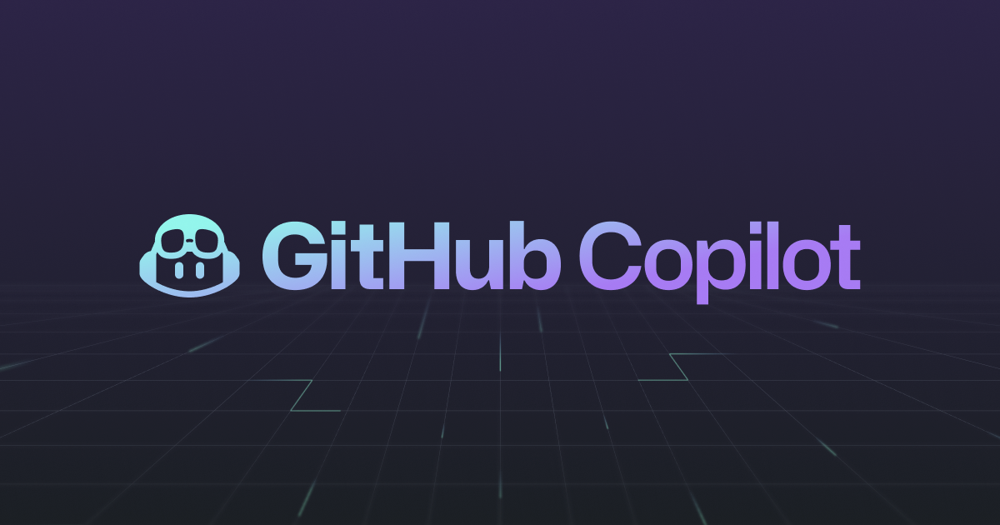

## GitHub Copilot Workshop



## A course teaching everything you need to know to start working with GitHub Copilot and Context Engineering


[](https://github.com/notoriousmic/github-copilot-workshop/blob/main/LICENSE)
[](https://GitHub.com/notoriousmic/github-copilot-workshop/graphs/contributors/)
[](https://GitHub.com/notoriousmic/github-copilot-workshop/issues/)
[](https://GitHub.com/notoriousmic/github-copilot-workshop/pulls/)
[](http://makeapullrequest.com)

## About the Workshop

This project is designed as a workshop to explore and demonstrate the capabilities of GitHub Copilot. It provides hands-on examples and interactive content to help users understand how to effectively use Copilot in their development workflows.

- **Who this is for**: Developers, DevOps Engineers, Engineering Managers, and anyone interested in AI-assisted coding.
- **What you'll learn**: How to use GitHub Copilot in CLI, VS Code, and the web interface.
- **What you'll build**: Real-world applications using GitHub Copilot's AI assistance.
- **Prerequisites**: [📋 Complete the setup guide](workshop/prerequisite.md) before starting the workshop.
- **How long**: Each workshop part can be completed in 30-60 minutes.

---

## 🚀 Getting Started

<!-- For start course, run in JavaScript:
'https://github.com/new?' + new URLSearchParams({
  template_owner: 'skills',
  template_name: 'code-with-codespaces',
  owner: '@me',
  name: 'skills-code-with-codespaces',
  description: 'My clone repository',
  visibility: 'public',
}).toString()
-->

[](https://github.com/new?github-copilot-workshop&template_owner=notoriousmic&owner=@me&name=github-copilot-workshop&description=My+clone+repository&visibility=public)

> **Important**: Before starting any workshop, please complete the [Prerequisites](workshop/prerequisite.md) to set up your environment.

### Workshop Lessons

| # | Workshop Part | Description | Link |
|---|---------------|-------------|------|
| 0 | **Prerequisites** | Set up GitHub Copilot CLI, VS Code extension, and authentication | [📋 prerequisite.md](workshop/prerequisite.md) |
| 1 | **GitHub Copilot CLI** | Learn how to use GitHub Copilot in the command line interface | [📁 github-copilot-cli/](workshop/github-copilot-cli/) |
| 2 | **GitHub Copilot in VS Code** | Explore how to integrate and use GitHub Copilot within Visual Studio Code | [📁 github-copilot-vscode/](workshop/github-copilot-vscode/) |
| 3 | **Advanced GitHub Copilot in VS Code** | Dive into advanced features and workflows for using GitHub Copilot in VS Code | [📁 github-copilot-vscode-advanced/](workshop/github-copilot-vscode-advanced/) |
| 4 | **GitHub Copilot Inside GitHub** | Understand how to work with Copilot on the web | [📁 github-copilot-web/](workshop/github-copilot-web/) |
| 5 | **Leveraging Ralph with GitHub Copilot** | Understand how to work with Ralph on GitHub Copilot | [📁 github-copilot-ralph/](workshop/github-copilot-ralph/) |

### What You'll Learn

1. **Introduction to GitHub Copilot**:
   - Overview of Copilot's features and how it assists in code generation.

2. **Using Copilot for Python Development**:
   - Practical examples of using Copilot to write Python code, including Flask applications.

3. **Debugging with Copilot**:
   - Learn how Copilot can assist in identifying and fixing bugs in your code.

4. **Advanced Copilot Features**:
   - Explore advanced topics like Context Engineering, custom modes, Ralph etc..


## Project Features

- **Homepage**: Overview of GitHub Copilot features and capabilities
- **Examples Page**: Practical code examples showing how Copilot generates code from natural language prompts
- **About Page**: Information about the workshop and best practices for using Copilot

## Technologies Used

- **Python 3.x**: Backend programming language
- **Flask**: Lightweight web framework
- **HTML/CSS**: Frontend structure and styling
- **Jinja2**: Template engine (included with Flask)

## Installation

1. Make sure you have Python 3.x installed on your system:
   ```bash
   python3 --version
   ```

2. Install the required dependencies:
   ```bash
   pip3 install -r requirements.txt
   ```

   Or install Flask directly:
   ```bash
   pip3 install Flask==3.0.0
   ```

## Running the Website

1. Navigate to the project directory:
   ```bash
   cd github-copilot-workshop
   ```

2. Run the Flask application:
   ```bash
   python3 app.py
   ```

   For development with debug mode enabled:
   ```bash
   FLASK_DEBUG=true python3 app.py
   ```

3. Open your web browser and visit:
   ```
   http://localhost:5000
   ```

The website will be running locally on port 5000. You can now explore the different pages to learn about GitHub Copilot capabilities!

## Project Structure

```
github-copilot-workshop/
├── app.py                  # Main Flask application
├── requirements.txt        # Python dependencies
├── README.md              # This file
├── templates/             # HTML templates
│   ├── base.html         # Base template with navigation
│   ├── index.html        # Homepage
│   ├── examples.html     # Code examples page
│   └── about.html        # About page
└── static/               # Static files
    └── css/
        └── style.css     # CSS styles
```
