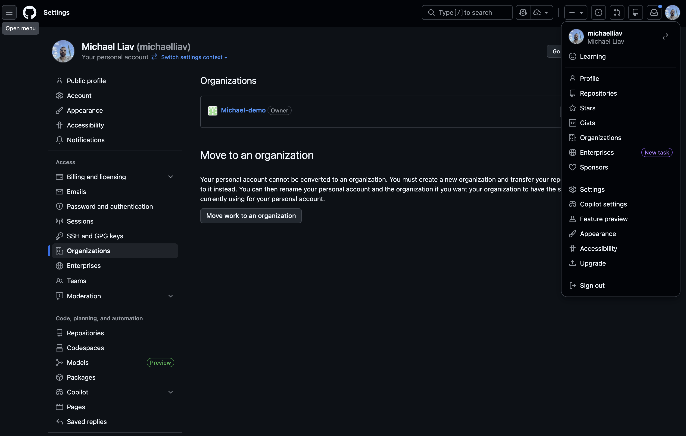
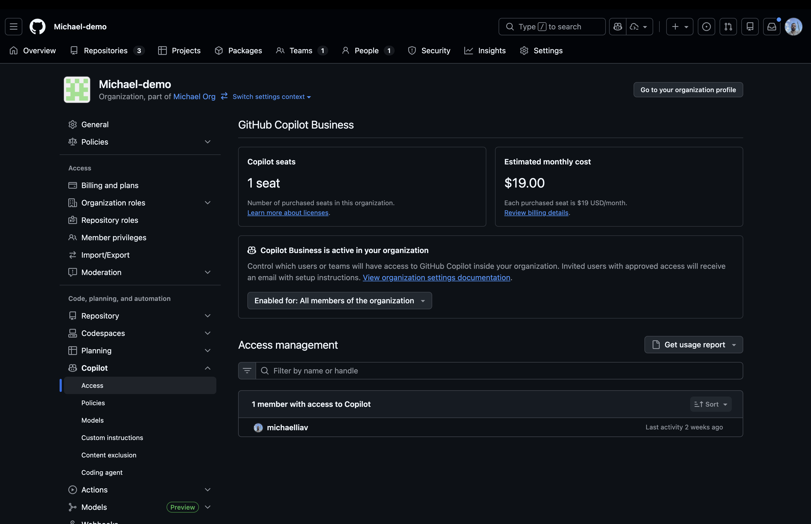
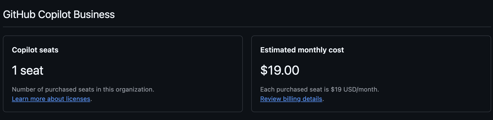
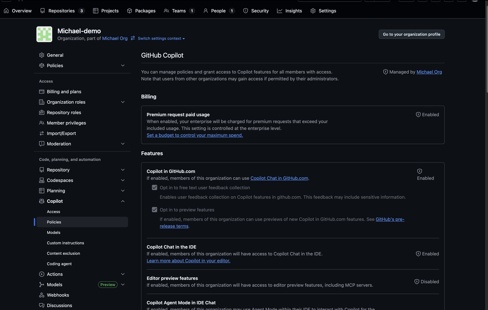
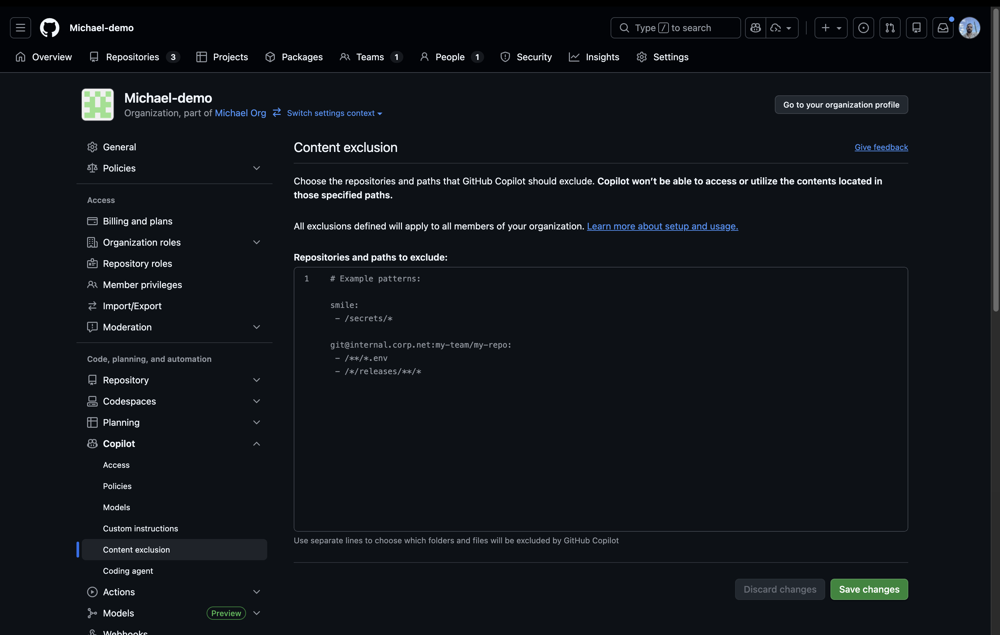
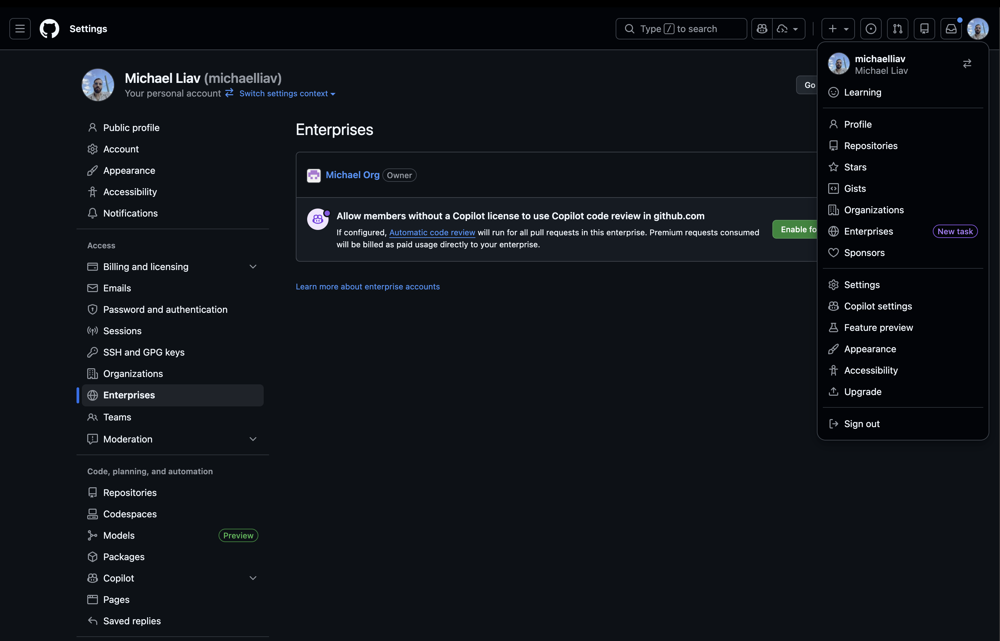
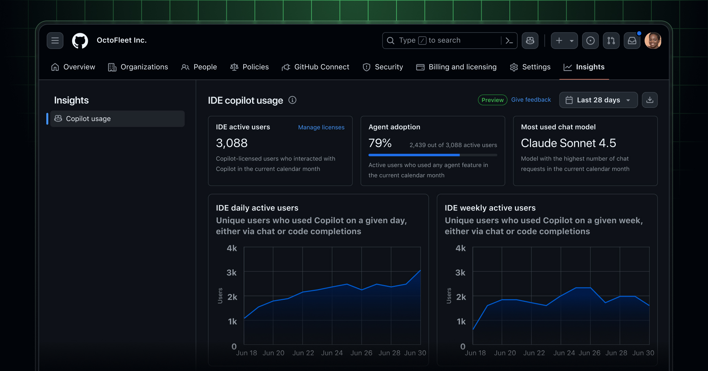
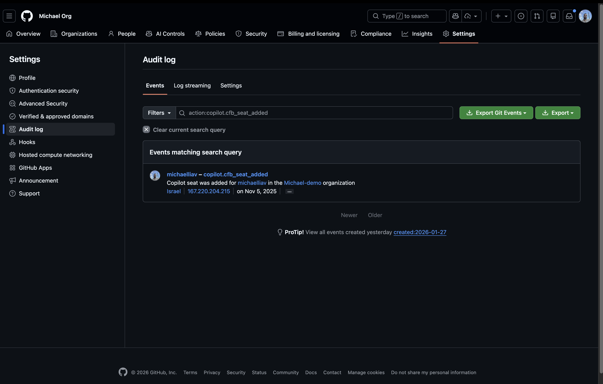

# 🔐 GitHub Copilot Admin Workshop - Organization Management Edition
*Master AI governance, policies, and analytics to successfully onboard your organization to GitHub Copilot*

---
## 🎯 Workshop Overview

Welcome to the comprehensive GitHub Copilot administration workshop! This hands-on guide will empower you to effectively manage, monitor, and optimize GitHub Copilot across your organization. Learn how to control access, configure policies, review usage metrics, and ensure secure AI-powered development at scale.

### What You'll Master
- 👥 **Access Management**: Grant and revoke Copilot licenses efficiently across teams
- 🛡️ **Policy Configuration**: Control features, models, and security settings organization-wide
- 📊 **Usage Analytics**: Monitor adoption, ROI, and compliance with detailed metrics
- 🔒 **Security Controls**: Implement content exclusions and manage sensitive code
- ⚙️ **Feature Governance**: Enable the right Copilot capabilities for your teams
- 🚀 **Successful Onboarding**: Guide your organization through AI-powered development adoption

---

## 🛠️ Workshop Instructions

### 🌟 Understanding Your Role as a GitHub Copilot Admin

As a GitHub Copilot organization owner, you have comprehensive control over how AI assistance is deployed, used, and monitored across your teams. This workshop will guide you through essential administrative tasks to ensure successful adoption while maintaining security and compliance standards.

### Key Admin Capabilities
   - 👥 **License Management** – Control who has access to Copilot and manage seat assignments
   - 🛡️ **Policy Configuration** – Define organizational policies for features, models, and security
   - 📈 **Usage Monitoring** – Track adoption metrics, engagement, and ROI across your organization
   - 🔒 **Security Controls** – Manage content exclusions and sensitive code protection
   - 🎯 **Compliance & Governance** – Ensure AI usage aligns with organizational standards

---

## 📋 Task 1: Setting Up Your Organization for Copilot Success

> **🎭 Scenario:** *Your organization has just purchased GitHub Copilot Business licenses, and you need to set up the foundation for successful adoption. Your mission: configure access, establish policies, and create a governance framework that balances developer productivity with security requirements.*

### 🎯 Objective
Establish a solid foundation for GitHub Copilot in your organization by configuring initial settings, managing access, and setting up governance policies.

---

### 📝 Step-by-Step Instructions

#### 🚀 Phase 1: Access the Copilot Management Console

1. **🔑 Navigate to Organization Settings**
   - Go to GitHub.com and sign in
   - Click your profile picture in the upper-right corner
   - Select **Your organizations**
   - Click on the organization you want to manage
   - Click **Settings** in the organization menu

   
   *Navigate to your organization's settings page from the profile menu*

2. **🤖 Open Copilot Administration Panel**
   - In the left sidebar, under "Code, planning, and automation"
   - Click **Copilot**
   - You'll see three main tabs:
     - **Access**: Manage who can use Copilot
     - **Policies**: Configure features and model availability
     - **Usage**: Review metrics and activity

#### ✨ Phase 2: Configure Seat Assignments and Access

3. **👥 Grant Access to Organization Members**

   
   *Choose how to grant Copilot access: all members, specific teams, or individuals*

   **Option A: Enable for All Members**
   - Navigate to the **Access** tab
   - Click **Enable for: All members of the organization**
   - This automatically provides access to all current and future members
   - Best for organizations fully committed to AI-powered development

   **Option B: Enable for Specific Teams**
   - Click **Enable for: Select teams**
   - Choose specific teams from the dropdown menu
   - Ideal for phased rollouts or department-specific adoption
   - Examples: "Engineering", "QA Team", "DevOps"

   **Option C: Enable for Individual Members**
   - Click **Enable for: Select members**
   - Search and select individual users
   - Perfect for pilot programs or limited rollouts

4. **🔍 Review and Monitor Seat Usage**
   - Track active seats vs. purchased licenses
   - Monitor which users have accepted their Copilot access
   - Review pending access requests (if enabled)

   
   *Monitor active seats, pending invitations, and license utilization*

#### 🎯 Phase 3: Configure Organizational Policies

> **Note:** If you have GitHub Enterprise you can control all the policies from the enterprise level to all of your organizations.

5. **🛡️ Navigate to Policy Configuration**
   - Click the **Policies** tab in Copilot settings
   - Review all available policy options
   - Consider your organization's security and compliance requirements

   
   *The Policies tab showing available policy controls and enforcement options*

6. **⚙️ Configure Essential Policies**

   **Key Policy Options:**

   **A. Suggestions Matching Public Code**
   - **Blocked**: Copilot won't suggest code that matches public repositories
   - **Allowed**: Copilot can suggest matching public code (shows references)
   - **Use Case**: Enable "Blocked" for high-security environments

   **B. Copilot Chat in GitHub.com**
   - Enable: Allows developers to use chat features on github.com
   - Disable: Restricts chat to IDE environments only
   - **Recommendation**: Enable for maximum productivity

   **C. Copilot in GitHub Mobile**
   - Enable/Disable mobile access to Copilot features
   - Consider mobile security policies before enabling

   **D. Copilot CLI**
   - Enable/Disable command-line Copilot assistance
   - Useful for DevOps and infrastructure teams

   **E. Copilot in IDE**
   - Control availability in VS Code, Visual Studio, JetBrains IDEs
   - Core feature - typically enabled for all users

7. **🎨 Configure Advanced Model Access (Optional)**
   - Navigate to the **Models** tab
   - Review available AI models beyond base models
   - Note: Premium models may incur additional usage costs
   - Configure based on team needs and budget

#### 🔒 Phase 4: Implement Security Controls

8. **🛡️ Set Up Content Exclusions**

   Content exclusions prevent Copilot from accessing sensitive files or repositories. This is critical for protecting proprietary code, credentials, or regulated information.

   
   *Configure content exclusions to protect sensitive files and directories*

   **Repository-Level Exclusions:**
   ```yaml
   # In your repository, create or edit: .github/copilot-ignore.json
   {
     "ignored_files": [
       "secrets/**",
       "config/credentials.yml",
       "**/*.key",
       "**/secrets.json"
     ]
   }
   ```

   **Organization-Level Exclusions:**
   - Navigate to **Settings** > **Copilot** > **Content Exclusions**
   - Add path patterns to exclude across all repositories
   - Examples:
     - `**/secrets/**` - Exclude all secrets directories
     - `**/config/production.yml` - Exclude production configs
     - `**/*.pem` - Exclude certificate files

9. **🔍 Review Security Best Practices**
   - Regularly audit content exclusions
   - Educate developers on secure coding with AI
   - Monitor for accidental exposure of sensitive data
   - Review audit logs for compliance

---

### 💡 Pro Tips for Successful Setup
- 🎯 **Start Small**: Begin with a pilot team before organization-wide rollout
- 📝 **Document Policies**: Create internal guidelines for Copilot usage
- 👥 **Gather Feedback**: Regularly survey users about their Copilot experience
- 🔄 **Iterate**: Adjust policies based on team needs and security requirements
- 📊 **Monitor Adoption**: Track usage metrics to ensure value realization

---

## 📊 Task 2: Monitoring Usage and Measuring Success with GitHub Enterprise

> **🎭 Scenario:** *Your organization has been using GitHub Copilot for several weeks. Leadership wants to understand adoption rates, identify power users, and measure the return on investment. Your mission: leverage GitHub's analytics to demonstrate value and identify optimization opportunities.*

### 🎯 Objective
Use GitHub Copilot's analytics and reporting features to track adoption, measure impact, and make data-driven decisions about your Copilot deployment.

---

### 📝 Step-by-Step Instructions

#### 📈 Phase 1: Access Usage Analytics

1. **🔍 Navigate to Usage Dashboard**
   
   - Click on your profile picture and choose your enterprise
   - Click **Insights** in the navigation bar
   - View comprehensive usage metrics

   
   *The Usage tab displaying key metrics, adoption rates, and engagement trends*

2. **📊 Understanding Key Metrics**

   **Active Users Metrics:**
   - **Total Seats Assigned**: Number of licenses distributed
   - **Active Users**: Users who engaged with Copilot in the time period
   - **Acceptance Rate**: Percentage of suggestions accepted by developers
   - **Engagement Trend**: Usage patterns over time

   **Productivity Indicators:**
   - **Suggestions Shown**: Total code suggestions offered
   - **Suggestions Accepted**: Code completions actually used
   - **Lines of Code Suggested**: Volume of AI-generated code
   - **Chat Interactions**: Questions asked to Copilot Chat

#### 🎯 Phase 2: Analyze User Activity Data

3. **👥 Review Individual User Engagement**

   Access detailed user activity to identify:
   - **Power Users**: Developers heavily leveraging Copilot
   - **Low Adoption**: Users who may need training or support
   - **Feature Usage**: Which Copilot capabilities are most popular

4. **📈 Generate Usage Reports**

   **Weekly/Monthly Review Process:**
   ```
   1. Export usage data from the Usage tab
   2. Identify trends in adoption rates
   3. Compare team-by-team utilization
   4. Correlate usage with productivity metrics
   5. Identify training opportunities
   ```

5. **🎯 Calculate ROI Metrics**

   **Key Questions to Answer:**
   - Are developers more productive with Copilot?
   - What is the average acceptance rate across teams?
   - Which teams show highest engagement?
   - Are there features being underutilized?

   **Example ROI Framework:**
   ```
   Time Saved = (Accepted Suggestions × Avg. Time per Line) 
   Cost Savings = Time Saved × Avg. Developer Hourly Rate
   ROI = (Cost Savings - Copilot License Cost) / Copilot License Cost × 100%
   ```

#### 🔍 Phase 3: Access Audit Logs for Compliance

6. **📋 Review Copilot Audit Logs**

   GitHub Copilot Business provides comprehensive audit logs for compliance and security monitoring.

   
   *Filter and review Copilot-related events in the organization audit log*

   **Accessing Audit Logs:**
   - Navigate to **Settings** > **Audit log** in your organization
   - Filter by Copilot-related events:
     - `action:copilot.cfb_seat_added` - When licenses are granted
     - `action:copilot.cfb_seat_assignment_unassigned` - When licenses are revoked
     - `copilot.content_exclusion_changed` - Security policy changes
     - `copilot.organization_policy_changed` - Policy modifications

   - Integrate with SIEM tools if required

#### 💼 Phase 4: Create Executive Reports

7. **📊 Build Stakeholder Dashboards**

   **Sample Executive Summary Template:**
   ```markdown
   # GitHub Copilot Monthly Report - [Month/Year]

   ## Executive Summary
   - Total Active Users: [X] / [Y] assigned seats ([Z]% activation)
   - Suggestions Acceptance Rate: [X]%
   - Estimated Time Saved: [X] developer hours
   - ROI: [X]%

   ## Adoption Trends
   - [Chart showing usage over time]
   - Top performing teams: [List]
   - Areas needing support: [List]

   ## Key Insights
   - [Insight 1]
   - [Insight 2]
   - [Insight 3]

   ## Recommendations
   - [Action item 1]
   - [Action item 2]
   - [Action item 3]
   ```

8. **🎯 Identify Optimization Opportunities**
   - Teams with low adoption → Schedule training sessions
   - High acceptance rates → Share best practices organization-wide
   - Underutilized features → Create awareness campaigns
   - Security concerns → Review and update content exclusions

---

### 💡 Pro Tips for Measuring Success
- 📈 **Track Trends**: Monitor month-over-month changes, not just snapshots
- 🎯 **Set Benchmarks**: Establish baseline metrics and improvement targets
- 👥 **Survey Users**: Combine analytics with qualitative feedback
- 🔄 **Regular Reviews**: Schedule monthly stakeholder review meetings
- 📊 **Visualize Data**: Use charts and graphs for executive presentations

---

## 🎓 Task 3: Advanced Administration - Copilot Coding Agent & Custom Features

> **🎭 Scenario:** *Your organization wants to leverage GitHub's latest Copilot capabilities, including the Copilot coding agent that can work on issues autonomously and custom agents for specialized workflows. Your mission: explore advanced features and configure them appropriately for your organization's needs.*

### 🎯 Objective
Enable and configure advanced GitHub Copilot features including the coding agent, custom agents, and specialized capabilities to maximize team productivity.

---

### 📝 Step-by-Step Instructions

#### 🤖 Phase 1: Enable Copilot Coding Agent

1. **🚀 Understanding Copilot Coding Agent**

   The Copilot coding agent can:
   - Be assigned to GitHub issues to work autonomously
   - Create pull requests with code changes to resolve issues
   - Analyze codebases and implement features independently
   - Follow your repository's coding standards and patterns

2. **⚙️ Configure Coding Agent for Your Organization**

   **Prerequisites:**
   - GitHub Copilot Business or Enterprise subscription
   - Organization owner permissions
   - Repositories where you want to enable the agent

   **Setup Steps:**
   - Navigate to **Settings** > **Copilot** > **Policies**
   - Locate **Copilot coding agent** setting
   - Choose your deployment strategy:
     - **All repositories**: Enable organization-wide
     - **Selected repositories**: Pilot with specific repos
     - **Disabled**: Not available to organization

3. **🎯 Using the Coding Agent Effectively**

   **Best Practices:**
   ```markdown
   When creating issues for the coding agent:
   1. Provide clear, detailed descriptions
   2. Include acceptance criteria
   3. Specify coding standards or patterns
   4. Reference relevant files or documentation
   5. Set appropriate base branches

   Example Issue Format:
   ---
   Title: Add user authentication to API endpoint
   
   Description:
   Implement JWT-based authentication for the /api/users endpoint.
   
   Requirements:
   - Use existing auth middleware pattern from /api/products
   - Add unit tests with >80% coverage
   - Update API documentation
   - Follow error handling patterns in utils/errors.py
   
   Acceptance Criteria:
   - [ ] Endpoint requires valid JWT token
   - [ ] Returns 401 for invalid tokens
   - [ ] Tests pass in CI/CD pipeline
   - [ ] Documentation updated
   ```

4. **🔍 Monitoring Coding Agent Activity**
   - Review pull requests created by the agent
   - Ensure code quality meets standards
   - Provide feedback to improve future suggestions
   - Track success rate and time savings

#### 🎨 Phase 2: Prepare for Custom Agents

5. **🛠️ Setting Up Custom Agent Infrastructure**

   Custom agents allow you to create specialized AI assistants for your organization's specific needs.

   **Configuration Steps:**
   - Navigate to **Settings** > **Copilot**
   - Select **Custom Agents** (if available in your plan)
   - Designate a repository for agent configurations
   - Set up agent definitions and capabilities

6. **📝 Custom Agent Use Cases**

   **Examples:**
   - **Code Review Agent**: Specialized in your organization's standards
   - **Documentation Agent**: Maintains consistency across docs
   - **Testing Agent**: Generates tests following your patterns
   - **Security Agent**: Identifies vulnerabilities specific to your stack
   - **Migration Agent**: Assists with framework or language migrations

#### ⚙️ Phase 3: Advanced Policy Configuration

7. **🔒 Fine-Tune Feature Access**

   **Enable Preview Features:**
   - Navigate to **Policies** tab
   - Locate **Preview features** toggle
   - **Consider carefully**: Preview features may have limitations
   - Best for: Innovation-focused teams willing to provide feedback

8. **📊 Configure User Feedback Collection**
   - Enable **User feedback collection** if available
   - Helps GitHub improve Copilot based on your organization's usage
   - Privacy-conscious: No code is shared, only aggregated feedback

9. **🌐 Network Access Control (Enterprise)**

   For organizations requiring strict network controls:
   - Configure subscription-based network routing
   - Control which networks can access Copilot services
   - Implement additional security layers for sensitive environments
   - Document network policies for compliance

#### 🎯 Phase 4: Create an Onboarding Program

10. **📚 Develop Training Materials**

    **Essential Components:**
    ```markdown
    1. Welcome Guide
       - What is GitHub Copilot?
       - How to install and activate
       - Basic usage patterns
       - Organization-specific policies

    2. Quick Start Tutorial
       - First code suggestion
       - Using Copilot Chat
       - Inline chat and commands
       - Best practices

    3. Advanced Techniques
       - Prompt engineering for better results
       - Using agents effectively
       - Debugging with Copilot
       - Test generation strategies

    4. Security & Compliance
       - Content exclusions
       - Handling sensitive data
       - Code review requirements
       - Acceptable use policy
    ```

11. **🚀 Launch Internal Copilot Champions Program**

    **Program Structure:**
    - Identify early adopters and power users
    - Train champions on advanced features
    - Empower champions to support their teams
    - Create feedback loops for continuous improvement
    - Share success stories across organization

12. **📅 Schedule Regular Training Sessions**
    - Monthly "Copilot Office Hours" for Q&A
    - Quarterly feature update sessions
    - Team-specific deep dives
    - New hire onboarding integration

---

### 💡 Pro Tips for Advanced Administration
- 🎯 **Experiment Safely**: Use preview features in non-production repos first
- 📝 **Document Everything**: Create internal wiki with policies and patterns
- 👥 **Build Community**: Foster knowledge sharing among Copilot users
- 🔄 **Stay Updated**: Monitor GitHub's release notes for new features
- 📊 **Measure Impact**: Track metrics before and after enabling new features
- 🤝 **Collaboration**: Regular sync with organization owners to prevent friction
- 📚 **Clear Communication**: Announce policy changes with sufficient lead time

---

## 🏆 Workshop Success Checklist

By the end of this workshop, you should have accomplished:

**Organization-Level:**
- [ ] **Access Management**: Configured seat assignments for your organization
- [ ] **Policy Configuration**: Established security and feature policies
- [ ] **Content Exclusions**: Protected sensitive code and credentials
- [ ] **Usage Monitoring**: Set up analytics review process
- [ ] **Audit Logging**: Configured compliance tracking
- [ ] **Advanced Features**: Enabled appropriate advanced capabilities
- [ ] **ROI Measurement**: Established metrics for success tracking
- [ ] **Champion Network**: Identified and trained internal advocates
- [ ] **Documentation**: Created organization-specific guidelines

**Enterprise-Level (if applicable):**
- [ ] **Enterprise Policies**: Configured mandatory policies across all organizations
- [ ] **Consolidated Metrics**: Set up enterprise-wide analytics dashboard
- [ ] **Cross-Org Governance**: Established enterprise governance framework
- [ ] **Enterprise Exclusions**: Implemented company-wide content exclusions
- [ ] **Compliance Framework**: Created audit and compliance processes
- [ ] **Cost Management**: Set up budget tracking and alerts
- [ ] **Multi-Org Rollout**: Planned phased deployment strategy
- [ ] **Executive Reporting**: Created enterprise ROI dashboards
- [ ] **Training Standards**: Established enterprise-wide training program
- [ ] **Center of Excellence**: Formed cross-org collaboration group

---

## 🌟 Admin Best Practices & Common Scenarios

### 🎯 Scenario-Based Guidance

#### Scenario 1: Phased Rollout Strategy
```markdown
Week 1-2: Pilot Team (5-10 developers)
- Enable for engineering leadership team
- Gather initial feedback
- Identify early challenges
- Measure baseline productivity

Week 3-4: Expand to Core Teams
- Add 2-3 full development teams
- Monitor usage patterns
- Conduct training sessions
- Refine policies based on feedback

Week 5-8: Organization-Wide
- Enable for all eligible members
- Launch champion program
- Establish support channels
- Begin formal ROI tracking
```

#### Scenario 2: Handling Security Concerns
```markdown
Common Concern: "Will Copilot expose our proprietary code?"

Admin Response:
1. Explain GitHub's security model
2. Demonstrate content exclusions
3. Review audit log capabilities
4. Share Copilot Trust Center resources
5. Configure policies to address specific concerns
6. Provide written security documentation
```

#### Scenario 3: Low Adoption Troubleshooting
```markdown
If usage metrics are lower than expected:

1. Survey users to identify barriers
   - Installation issues?
   - Lack of awareness?
   - Unclear value proposition?
   - Need for training?

2. Take corrective action
   - Host lunch-and-learn sessions
   - Create demo videos
   - Share success stories
   - Provide hands-on workshops
   - Assign mentors/champions

3. Monitor improvement
   - Track weekly usage trends
   - Celebrate milestones
   - Recognize top users
```

---

## 📚 Essential Resources

### 📖 Official Documentation

**Organization-Level:**
- [GitHub Copilot for Organizations](https://docs.github.com/en/copilot/how-tos/administer-copilot/manage-for-organization)
- [Managing Access](https://docs.github.com/en/copilot/how-tos/administer-copilot/manage-for-organization/manage-access)
- [Managing Policies](https://docs.github.com/en/copilot/how-tos/administer-copilot/manage-for-organization/manage-policies)
- [Reviewing Activity](https://docs.github.com/en/copilot/how-tos/administer-copilot/manage-for-organization/review-activity)

**Enterprise-Level:**
- [GitHub Copilot for Enterprises](https://docs.github.com/en/enterprise-cloud@latest/copilot/overview-of-github-copilot/github-copilot-in-the-enterprise)
- [Setting up Copilot for Enterprise](https://docs.github.com/en/enterprise-cloud@latest/copilot/setting-up-github-copilot/setting-up-github-copilot-for-your-enterprise)
- [Managing Copilot Policies in Enterprise](https://docs.github.com/en/enterprise-cloud@latest/copilot/managing-github-copilot-in-your-organization/managing-policies-and-features-for-copilot-in-your-organization)
- [Enterprise Audit Logs](https://docs.github.com/en/enterprise-cloud@latest/admin/monitoring-activity-in-your-enterprise/reviewing-audit-logs-for-your-enterprise/about-the-audit-log-for-your-enterprise)

**Security & Compliance:**
- [GitHub Copilot Trust Center](https://copilot.github.trust.page/)
- [Content Exclusions Documentation](https://docs.github.com/en/copilot/managing-copilot/managing-copilot-as-an-organization-admin/configuring-content-exclusions-for-github-copilot)

### 🎥 Training & Education
- [GitHub Copilot Learning Path](https://learn.microsoft.com/en-us/training/modules/get-started-github-copilot/)
- [GitHub Skills - Copilot Courses](https://skills.github.com/)

---

## 💬 Building Your Support Network
- 💬 **GitHub Community**: [github.com/orgs/community](https://github.com/orgs/community)
- 🐦 **GitHub Blog**: [github.blog](https://github.blog/)
- 📺 **GitHub Universe**: Annual conference for latest updates
- 📧 **GitHub Support**: For technical issues and questions

---

## 💡 Final Words

GitHub Copilot represents a transformative shift in how organizations build software. As an admin, you play a crucial role in ensuring this technology is adopted successfully, used securely, and delivers measurable value to your organization.

Remember:
- **Start small** and scale thoughtfully
- **Listen to your users** and adapt policies accordingly
- **Measure impact** and communicate successes
- **Stay curious** about new features and capabilities
- **Build community** around AI-powered development

*Happy Administering! 🚀*

---

## 📜 Workshop Feedback

We'd love to hear about your experience with this workshop:

- 🐦 **Connect on LinkedIn**: [Michael Liav LinkedIn](https://www.linkedin.com/in/michael-liav-a5484b220/)
- 💡 **Share Your Success**: Tell us how Copilot transformed your organization
- 🌟 **Star This Repository**: Help other admins discover this resource
- 📝 **Contribute**: Submit improvements or additional scenarios


