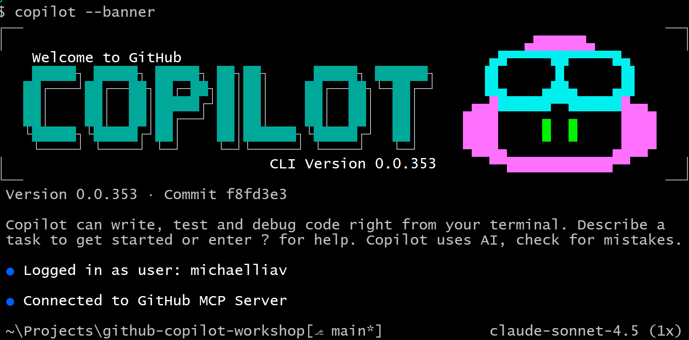

# 🚀 GitHub Copilot Workshop - CLI Edition
*Master AI-powered development in your terminal with GitHub's most intelligent command-line assistant*

---
## 🎯 Workshop Overview

Welcome to an immersive command-line experience with GitHub Copilot CLI! This hands-on workshop will revolutionize your terminal workflow by leveraging AI to solve complex problems, debug issues, and automate tasks with unprecedented efficiency—all without leaving your command line.

### What You'll Master
- 💻 **Terminal-Native AI**: Access powerful AI assistance directly in your command line
- 🔧 **Instant Problem Solving**: Get immediate solutions for shell commands, scripts, and errors
- 🐛 **Advanced Debugging**: Diagnose and fix issues with AI-powered analysis
- ⚡ **Script Generation**: Create complex automation scripts in seconds
- 🎯 **Multi-Model Access**: Leverage different AI models for specialized tasks

---

## 🛠️ Workshop Instructions

### 🌟 Getting Started with GitHub Copilot CLI

GitHub Copilot CLI brings the power of AI directly to your terminal, providing intelligent assistance for any command-line task. It's like having an expert developer pair-programming with you in the terminal.



### GitHub Copilot CLI Features
   - 🤖 **Conversational AI** – Ask questions and get instant answers without leaving your terminal
   - 💡 **Command Suggestions** – Get intelligent command recommendations for any task
   - 🔍 **Code Analysis** – Analyze code, logs, and errors directly from the command line
   - 🎯 **Context-Aware** – CLI understands your current directory and project context
   - 🛠️ **Multi-Model Support** – Switch between Claude Sonnet 4.5, GPT-5, and other models

---
## Basic commands  
- ```bash copilot --banner``` - opens copilot through the terminal
- ```bash /login``` - Connect GitHub Copilot to our github account
- ```bash /agent``` - Browse and select from available agents if you deployed them in github.
- ```bash /cwd``` - Shows current directory or change directory
- ```bash /delegate``` - Allows you to delegate tasks to a remote repo with ai generated Pull Request
- ```bash /help``` - Show hep for interactive command
- ```bash /mcp``` - Allows you to connect MCP's to the github copilot cli
- ```bash /model``` - Allows you to choose model or change between models for different tasks
- ```bash @``` - Helps you set context to a certain file or path
- ```bash /usage``` - Allows you to see current token usage in the session

## 📋 Task 1: The Terminal Wizard - Master Command-Line Problem Solving

> **🎭 Scenario:** *You're working on a Flask application and need to set up the development environment, but you're not familiar with Python virtual environments or dependency management. Instead of searching documentation for hours, let's use GitHub Copilot CLI to guide us through the entire setup process efficiently.*

### 🎯 Objective
Set up a complete Python development environment and run the Flask application using only GitHub Copilot CLI for guidance.

---

### 📝 Step-by-Step Instructions

#### 🚀 Phase 1: Launch Your AI Terminal Assistant

1. **💻 Open Your Terminal**
   - Open your preferred terminal (PowerShell, Command Prompt, Bash, etc.)
   - Navigate to your workshop project directory

2. **🎯 Launch GitHub Copilot CLI**
   
   Start the CLI in your project directory:
   ```bash
   copilot --banner
   ```
   
   > 💡 **Pro Tip**: Always launch Copilot CLI in your project directory for better context awareness!

3. **🔐 Authenticate (If Needed)**
   - If prompted, use the `/login` command to authenticate with GitHub
   - Follow the on-screen instructions to complete authentication

#### 🔧 Phase 2: Environment Setup with AI Guidance

4. **🐍 Create Python Virtual Environment**
   
   Ask Copilot CLI:
   ```
   How do I create a Python virtual environment for this project?
   ```
   
   Follow the suggestions provided, which will likely include:
   - Creating a virtual environment with `python -m venv venv`
   - Activating the environment (varies by OS)
   - Understanding why virtual environments are important

5. **📦 Install Project Dependencies**
   
   Ask Copilot CLI:
   ```
   How do I install dependencies from requirements.txt?
   ```
   
   Execute the suggested command to install all required packages.

6. **🚀 Run the Flask Application**
   
   Ask Copilot CLI:
   ```
   How do I run this Flask application in development mode?
   ```
   
   Start the application using the recommended command.

#### ✨ Phase 3: Advanced CLI Techniques

7. **🔍 Explore Application Structure**
   
   Ask strategic questions:
   ```
   🔎 Discovery Questions:
   "What files are in this project and what do they do?"
   "How is this Flask app structured?"
   "What routes are available in app.py?"
   "What dependencies does this app have and why?"
   ```

8. **💬 Use Follow-Up Questions**
   
   Build on previous responses:
   ```
   "Can you explain that command in more detail?"
   "What are the alternative ways to do this?"
   "What could go wrong with this approach?"
   ```

---

### 💡 Pro Tips for Maximum Impact
- 🎯 **Be Conversational**: Ask questions naturally, like you would to a colleague
- 🔄 **Iterate**: Build on previous answers with follow-up questions
- 📝 **Copy Commands**: Use Copilot's suggested commands directly
- 🎨 **Context Matters**: The CLI understands your current directory and files

---

## 🐛 Task 2: The Debug Master - AI-Powered Error Resolution

> **🎭 Scenario:** *Your Flask application has bugs introduced by a buggy script. Instead of manually hunting through code and searching Stack Overflow, you'll use GitHub Copilot CLI to diagnose and fix issues directly from the terminal—faster than ever before.*

### 🎯 Objective
Identify, diagnose, and fix code errors using GitHub Copilot CLI's powerful debugging capabilities without opening an editor.

---

### 📝 Step-by-Step Instructions

#### 🎪 Phase 1: Release the Bugs

1. **🐞 Introduce Test Bugs**
   
   Run the bug introduction script:
   
   **For Windows (PowerShell):**
   ```powershell
   mv ./bugs/introduce_bugs.ps1 ./; ./introduce_bugs.ps1
   ```
   
   **For Linux/Mac (Bash):**
   ```bash
   mv ./bugs/introduce_bugs.sh ./; sh introduce_bugs.sh
   ```

2. **⚠️ Observe the Errors**
   
   Try running the application:
   ```bash
   python app.py
   ```
   
   You should see error messages—perfect for learning! 🎓

---

#### 🔍 Phase 2: AI-Powered Debugging

3. **🤖 Start Debugging Session**
   
   In Copilot CLI, describe the problem:
   ```
   My Flask app won't start. I'm getting errors. Can you help me analyze the error messages?
   ```

4. **📋 Share Error Output**
   
   Copy the error messages and ask:
   ```
   Here's the error I'm getting:
   [paste error message]
   
   What's causing this and how do I fix it?
   ```

5. **🔎 Deep Dive Analysis**
   
   Ask for comprehensive analysis:
   ```
   Can you analyze app.py and identify all the bugs that were introduced?
   ```

6. **🔧 Step-by-Step Fixes**
   
   For each issue, ask:
   ```
   "How do I fix the syntax error on line X?"
   "What's wrong with the variable naming in this function?"
   "How do I correct the indentation issues?"
   ```

7. **✅ Verify Fixes**
   
   After applying fixes, ask:
   ```
   Can you verify if my fixes are correct? Should I test anything specific?
   ```

#### 🎯 Phase 3: Advanced Debugging Techniques

8. **📊 File Analysis**
   
   Ask Copilot to analyze specific files:
   ```
   "Analyze app.py and list all potential issues"
   "What's wrong with the route definitions?"
   "Are there any security concerns in this code?"
   ```

9. **🧪 Testing Guidance**
   
   Get testing recommendations:
   ```
   "How should I test these fixes?"
   "What edge cases should I check?"
   "Can you suggest validation steps?"
   ```

---

### 💡 Pro Debugging Tips
- 🚨 **Copy Error Messages**: Always paste full error messages for better analysis
- 🔄 **Test Incrementally**: Fix one issue at a time and verify
- 📝 **Ask Why**: "Why did this error occur?" helps you learn
- 🎯 **Prevention**: "How can I prevent this type of bug in the future?"

---

## 🎛️ Task 3: The Model Master - Leverage Multi-Model Capabilities

> **🎭 Scenario:** *Different AI models excel at different tasks. Claude Sonnet might be better for code analysis, while GPT-5 might excel at documentation. Learn to switch between models to get the best results for each task.*

### 🎯 Objective
Master the use of different AI models in GitHub Copilot CLI to optimize results for different types of tasks.

---

### 📝 Step-by-Step Instructions

#### 🔄 Phase 1: Understanding Available Models

1. **📊 Check Available Models**
   
   In Copilot CLI, use the slash command:
   ```
   /model
   ```
   
   This shows all available models including:
   - Claude Sonnet 4.5 (default)
   - Claude Sonnet 4
   - GPT-5
   - And others

2. **🎯 Model Selection**
   
   Switch to a different model:
   ```
   /model gpt-5
   ```

#### ⚡ Phase 2: Model Comparison

3. **🧪 Test Different Models**
   
   Ask the same question with different models:
   
   **With Claude Sonnet:**
   ```
   /model claude-sonnet-4.5
   Explain how Flask routing works in this application
   ```
   
   **With GPT-5:**
   ```
   /model gpt-5
   Explain how Flask routing works in this application
   ```
   
   Compare the responses for depth, clarity, and usefulness.

4. **📝 Task-Specific Model Selection**
   
   Try different models for different tasks:
   
   - **Code Analysis**: `claude-sonnet-4.5`
   - **Documentation**: `gpt-5`
   - **Debugging**: `claude-sonnet-4`
   - **Script Generation**: Test both and see which you prefer

#### 🎨 Phase 3: Advanced Model Usage

5. **🔍 Specialized Queries**
   
   Ask about model capabilities:
   ```
   "Which model is better for analyzing Python code?"
   "What are the strengths of each available model?"
   ```

6. **🎯 Optimize Your Workflow**
   
   Develop preferences:
   ```
   "For my typical Flask development work, which model should I use?"
   ```

---

### 💡 Pro Model Tips
- 🎯 **Default Choice**: Claude Sonnet 4.5 is excellent for most tasks
- 🔄 **Experiment**: Try different models to find what works best for you
- 📝 **Context Matters**: Some models retain context better in long conversations
- ⚡ **Speed vs Depth**: Consider response time vs detail trade-offs

---

## 🏆 Workshop Success Metrics

By the end of this workshop, you should have mastered:

- [ ] **Terminal Fluency**: Navigate and solve problems entirely from the command line
- [ ] **AI-Assisted Setup**: Configure development environments with AI guidance
- [ ] **Advanced Debugging**: Diagnose and fix issues using CLI-based AI analysis
- [ ] **Model Optimization**: Choose and switch between AI models for optimal results
- [ ] **Workflow Efficiency**: Integrate Copilot CLI into your daily terminal workflow
- [ ] **Context Awareness**: Leverage project context for better AI responses

---

## 🌟 Advanced CLI Copilot Techniques

### 🔮 Pro Developer Workflows

- **🔍 Git Assistance**: Get help with complex git operations and merge conflicts
- **📚 Quick Learning**: Explore new tools and commands without leaving terminal
- **🚀 Infrastructure as Code**: Generate Terraform, Ansible, or Docker configurations
- **📊 Data Processing**: Create data transformation and analysis scripts


### 🎯 CLI-Specific Best Practices

- **Start Simple**: Begin with simple questions and build complexity
- **Stay in Context**: Keep conversations focused on your current task
- **Verify Commands**: Always understand commands before executing them
- **Learn Patterns**: Note common patterns for reuse in future sessions

---

## 📚 Additional Resources

- 📖 [GitHub Copilot CLI Documentation](https://docs.github.com/en/copilot/concepts/agents/about-copilot-cli)

---

## 💬 Share Your Success

Transform your command-line experience and share it with the community!

- 🐦 **Connect on LinkedIn**: [Michael Liav LinkedIn](https://www.linkedin.com/in/michael-liav-a5484b220/)
- 💡 **Share with Your Team**: Spread the AI-powered CLI revolution
- 🌟 **Star This Repository**: Help others discover these powerful techniques
- 📝 **Document Your Journey**: Create your own Copilot CLI success stories

---

## 🎓 Next Steps: Becoming a CLI Copilot Expert

### 🚀 Advanced Challenges

1. **Infrastructure Automation**: Generate complete deployment pipelines
2. **Monitoring Scripts**: Create comprehensive system monitoring solutions
3. **Data Processing**: Build ETL pipelines with AI assistance
4. **Security Automation**: Generate security scanning and audit scripts
5. **Cross-Platform Tools**: Create utilities that work across Windows, Mac, and Linux

### 📈 Continue Your Journey

- Integrate Copilot CLI into your daily workflow
- Create custom aliases and shortcuts for common Copilot queries
- Build a library of AI-generated scripts for your team
- Explore integration with other CLI tools and pipelines

---

## 📜 License

This workshop is part of the GitHub Copilot educational series, designed to empower developers with AI-assisted command-line capabilities.

*Happy Coding with AI in the Terminal! 🚀💻*
