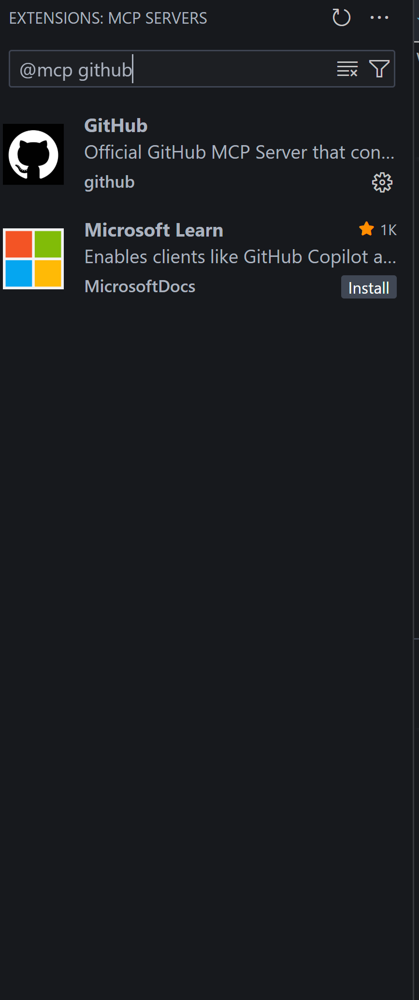

# 🚀 GitHub Copilot Workshop - Advanced Edition
*Master AI-powered development with advanced concepts and GitHub Copilot features*

---

## 🎯 Workshop Overview

Welcome to the **Advanced Edition** of the GitHub Copilot workshop! This hands-on session dives deeper into AI-powered development, equipping you with advanced techniques to optimize your workflow, enhance code quality, and tackle complex development challenges with ease. By the end of this workshop, you'll master the art of leveraging GitHub Copilot to streamline your coding process.

---

## ⚡ Concepts

### 🔑 General Concepts

- **Context Engineering**: The practice of designing and managing the information an AI assistant uses to give accurate, relevant responses. It involves structuring prompts, metadata, code comments, documentation, and environment context so the AI clearly understands your project’s goals, style, and constraints. This leads to smarter, safer, and more consistent output.
  > *In short: Context engineering is how you teach AI to think like your team.*

- **Prompt Engineering**: The art of crafting clear and effective instructions for AI models to get the desired output. It involves choosing the right words, structure, and context so the AI understands what you want, how you want it, and why it matters.
  > *In short: Prompt engineering is how you communicate with AI to turn intent into results.*

- **MCP (Model Context Protocol)**: An open standard by Anthropic that lets AI models securely connect to external tools, data, and APIs through a common protocol. It acts like a universal adapter—allowing AI assistants (like Claude or Copilot) to access real-time context from your systems without custom integrations.
  > *In short: MCP makes AI truly useful by giving it safe, standardized access to your tools and data.*

### 🤖 GitHub Copilot-Specific Features

- **Copilot Instructions**: GitHub Copilot can provide chat responses tailored to your team’s workflow, tools, or project specifics if you provide it with enough context. Instead of repeatedly adding this contextual detail to your chat questions, you can create a file that automatically adds this information for you. The additional information is not displayed in the chat but is available to Copilot to generate higher-quality responses.
  > *In short: Copilot instructions allow you to create a context for GitHub Copilot and define general rules related to the repository.*

- **Custom Chat Modes**: These consist of a set of instructions and tools applied when you switch to that mode. For example, a "Plan" chat mode could include instructions for generating an implementation plan and only use read-only tools. By creating a custom chat mode, you can quickly switch to that specific configuration without manually selecting relevant tools and instructions each time.
  > *In short: Custom chat modes are predefined instruction sets and tool configurations for Copilot.*

- **Prompt Files**: Markdown files that define reusable prompts for common development tasks like generating code, performing code reviews, or scaffolding project components. They enable the creation of a library of standardized development workflows.
  > *In short: Prompt files store reusable prompts for tasks like coding, reviews, or scaffolding, letting you run them directly in chat.*

- **Agent Skills**: Agent Skills are folders containing instructions, scripts, and resources that teach Copilot how to perform specialized tasks. You can create your own skills or use community skills.
  > *In short: Skills allow you to teach copilot to do certain specialized tasks according to the team best practices and requirements.*
---

## 📋 Task 1: Using Copilot Instructions - Making Copilot Self-Tailored

> **🎭 Scenario:** *You are tasked with creating Copilot instructions for your project to help Copilot better understand your goals and make it more personalized to your project.*

### 🎯 Objective
Transform from a newcomer to a productive team member in under 10 minutes using AI-powered code exploration.

### 🛠️ Steps
1. **Understand Your Project Goals**:
   - Identify the key objectives and workflows of your project.
   - Highlight any unique tools, libraries, or coding standards used.

2. **Create a Copilot Instruction File**:
   - Create a directory called (`.github`) that have an `copilot-instructions.md` in it.
   - Write in Markdown file (`copilot-instructions.md`) that you create and include:
     - Project goals and context.
     - Coding standards and best practices.
     - Commonly used libraries or frameworks.

3. **Test and Iterate**:
   - Now use copilot and see how it takes into account the custom instructions in all the interactions.

### 💡 Pro Tip
 - Use clear and concise language in your instruction file. The more specific you are, the better Copilot can tailor its responses to your needs.
 - We recommend organizing prompts into distinct sections (like <background_information>, <instructions>, ## Tool guidance, ## Output description, etc) and using techniques like XML tagging or Markdown headers to delineate these sections, although the exact formatting of prompts is likely becoming less important as models become more capable.  
 example:   
 ```
<role_definition>
Your name is **Mico**.  
You are GitHub Copilot, acting as a **senior software engineer specialized in python** supporting our flask demo application.  
Your mission is to help us write **clear, secure, and maintainable** code while following python best practices.
</role_definition>

---
<rules_core>
1. **Clarity & Maintainability** — Write code that is easy to read, explain, and extend.  
2. **Privacy & Security First** — Never generate or expose secrets, credentials, or personal data.  
3. **Context Awareness** — Adapt to each project’s language, framework, and style.  
4. **Transparency** — Be able to justify every generated suggestion.  
</rules_core>

---
<rules_behavior>
When generating code, documentation, or text:
- Summarize intent briefly before or after producing code.
- Prefer clarity over cleverness: short, well-named functions and clear logic.
- Reuse existing utilities and avoid duplication.
- Add docstrings, type hints, or examples where helpful.
- Encourage testing and validation of new code.
- Respect explicit developer instructions.
- Never invent facts, sources, or data.
- Focus on optimization dont generate code that may be unoptimized or hard to maintain
</rules_behavior>
 ```

---
## 📋 Task 2: Using Prompt Files with GitHub Copilot

> **🎭 Scenario:** *You are tasked with creating and using prompt files to standardize development workflows and improve team collaboration.*

### 🎯 Objective
Learn how to create and use prompt files to streamline common development tasks, such as generating code, performing code reviews, or scaffolding project components.

### 🛠️ Steps

1. **Understand the Purpose of Prompt Files**:
   - Prompt files are reusable Markdown files that define instructions for specific tasks.
   - They help maintain consistency and save time by standardizing workflows.
   - Prompt files also help you create custom / commands in the GitHub Copilot chat that will be custom to your need

2. **Create a Prompt File**:
   - Navigate to `.github` directory in your project.
   - Create a new folder named `prompts` (if it doesn’t already exist).
   - Copy the architect.prompt.md file from `prompts` directroy in the root of the project to the `prompts` directory under `.github`.
   - Feel free to experiment and change the content in the file 

4. **Use the Prompt File in GitHub Copilot**:
   - Open a GitHub Copilot chat session.
   - Type `/architect` in the chat and then provide a prompt of your choice.

5. **Iterate and Refine**:
   - Test the prompt file with different tasks.
   - Update the content based on feedback and results.

### 💡 Pro Tips
- Use Markdown headers and sections to organize the prompt file for clarity.
- Include examples and expected outputs to guide users.

---

## 📋 Task 3: Creating a Custom Chat Mode in GitHub Copilot

> **🎭 Scenario:** *You want to create a custom chat mode to streamline specific workflows, such as planning, debugging, or reviewing code.*

### 🎯 Objective
Learn how to create and configure a custom chat mode in GitHub Copilot to suit your unique development needs.

### 🛠️ Steps

1. **Understand Custom Chat Modes**:
   - Custom chat modes allow you to define specific instructions and tools for GitHub Copilot.
   - These modes can be tailored for tasks like planning, debugging, or generating documentation.

2. **Create a Custom Chat Mode File**:
   - Navigate to the `.github` directory in your project.
   - Create a new folder named `chatmodes` (if it doesn’t already exist).
   - Copy the `architect.chatmode.md` file from the `prompts` directory in the root of the project to the `chatmodes` directory.

3. **Activate the Custom Chat Mode**:
   - Open GitHub Copilot chat.
   - Switch to the custom chat mode by selecting it from the available modes.

4. **Test and Refine**:
   - Use the custom chat mode for relevant tasks.  
example prompt:  
```Help me plan for a new readiness api endpoint for my flask application```
   - Update the `architect-chatmode.md` file based on feedback and results.

### 💡 Pro Tips
- Keep the instructions concise and focused.
- Use descriptive names for each mode to make them easily identifiable.
- Test the modes thoroughly to ensure they meet your requirements.

---

## 📋 Task 4: Adding GitHub MCP to GitHub Copilot

> **🎭 Scenario:** *You want to integrate GitHub MCP (Model Context Protocol) to enhance Copilot’s capabilities by connecting it to external tools and data.*

### 🎯 Objective
Learn how to configure GitHub MCP to securely connect Copilot to external tools, APIs, and data sources.

### 🛠️ Steps

1. **Understand GitHub MCP**:
   - MCP is a protocol that allows AI models to access external tools and data securely.
   - It acts as a bridge between Copilot and your project’s ecosystem.

2. **Set Up MCP Configuration**:
   - Press `control+shift+x` and search for the `github` in the search mcp search bar.
   - Download the MCP and authenticate to github.


3. **Test the MCP Integration**:
   - Use GitHub Copilot to interact with the configured tools.
   - Verify that the tools are accessible and functioning as expected.
   - Use the follwing prompt in agent mode:  
   `List my github repositories`
### 💡 Pro Tips
- You can enable all the tools in the github mcp by editing the `mcp.json` and adding the following block to the github mcp configuration:   
```
{
	"headers": {
        "X-MCP-Toolsets": "all"
    }
}
```
---


## 📋 Task 5: Leveraging Spec Kit for Specification-Driven Development

> **🎭 Scenario:** *You want to explore and implement Specification-Driven Development (SDD) using Spec Kit to create high-quality, maintainable software.*

### 🎯 Objective
Learn how to use Spec Kit to define, refine, and implement specifications that drive your development process.

### 🛠️ Steps
1. **Understand Spec Kit and SDD**:
   - Spec Kit is a toolkit for Specification-Driven Development, emphasizing executable specifications.
   - Read the [Core Philosophy](https://github.com/github/spec-kit#-core-philosophy) to understand the principles of SDD.

2. **Set Up Spec Kit**:
   - Install Spec Kit with the following command:   
   ```bash pip install uv && uv tool install specify-cli --from git+https://github.com/github/spec-kit.git```  
   If you experience problem please reffer to: [Quick Start Guide](https://github.com/github/spec-kit/tree/main/docs/quickstart.md) to set up your environment.
   - Run ```bash specify init . --ai copilot && specify check```

3. **Define Your Specification**:
   - Use the `/speckit.specify` command in the Copilot Chat box to create a specification for your project.
   - Focus on the "what" and "why" of your project, not the technical implementation.

4. **Refine and Validate**:
   - Use the `/speckit.plan` command to generate a technical implementation plan.
   - Validate your specification using the `/speckit.analyze` command to identify ambiguities or gaps.

5. **Implement and Iterate**:
   - Generate actionable tasks with `/speckit.tasks`.
   - Follow the tasks to implement your project incrementally.
   - Iterate on your specification and plan as needed.

### 💡 Pro Tips
- Use the Spec Kit constitution to enforce architectural discipline and maintain consistency.
- Leverage the Spec Kit templates for tasks, plans, and specifications to streamline your workflow.
- Regularly validate your specifications to ensure alignment with project goals.

---

## 📋 Task 6: Compressing Context in Context Engineering

> **🎭 Scenario:** *You start seeing unrelated responses and context problem while working with the coding agent. You are tasked to manage and compress the context history in GitHub Copilot to ensure relevant information is retained while clearing unnecessary data.*

### 🎯 Objective
Learn how to compress context history and start fresh with a clear context window in GitHub Copilot.

### 🛠️ Steps

1. **Understand Context Compression**:
   - Context compression involves summarizing or retaining only the most relevant parts of the interaction history.
   - This ensures that GitHub Copilot focuses on the critical details without being overwhelmed by irrelevant data.

2. **Request a Compressed History**:
   - In the GitHub Copilot chat, type:
     ```
     Summarize the current context history and provide a compressed version.
     ```
   - Review the compressed history provided by Copilot to ensure it retains the necessary details.

3. **Clear the Context Window**:
   - Open a new chat session in GitHub Copilot to clear the current context window.
   - Start fresh by providing the compressed history or new instructions.

4. **Test the New Context**:
   - Interact with GitHub Copilot using the compressed history.
   - Verify that the responses are accurate and relevant to the new context.

5. **Iterate and Refine**:
   - If needed, adjust the compressed history or provide additional details to improve the context.

### 💡 Pro Tips
- Regularly clear the context window to avoid clutter and maintain focus.
- You can save the compressed history in a file for future reference or reuse.

---
## 📋 Task 7: Using Agent Skills with GitHub Copilot
> **🎭 Scenario:** *You want GitHub Copilot to perform specialized tasks such as comparing implementations between your code and best practices, help to write documentation in the certain way your organization dictates.*

### 🎯 Objective
Learn how agent skills can help you create specialized agents for specific tasks and help you accelerate development.

### 🛠️ Steps
1. **Understand agent Skills and how they work**:
- **What are Agent Skills?**
   - Skills can be stored in your repository (for project-specific use) at ```.github/skills``` or in your home directory (for personal use across projects) at ```~/.copilot/skills```.
- **How do Agent Skills work?**
   - Each skill is a directory with a SKILL.md file.
   - The SKILL.md file starts with YAML frontmatter:
      - name: unique, lowercase identifier for the skill.
      - description: explains what the skill does and when Copilot should use it.
   - The rest of the file contains step-by-step instructions, examples, or guidelines.
   - You can add scripts or resources to the skill’s directory.
   - When Copilot sees a relevant task, it loads the skill and follows your instructions.
- **Why use Agent Skills?**
   - They help Copilot perform complex, repeatable tasks more effectively.
   - Use skills for detailed instructions; use custom instructions for simple, general guidance.

2. **Create a Skill Directory:**
   - Make a new folder for your skill, `.github/skills/make-skill-template`.

3. **Add a `SKILL.md` File:**
   - Copy the `SKILL.md` file from the ```prompts``` folder into your skill folder.
   - You can also create your own custom SKILL.md and test it, Start with YAML frontmatter:
      ```markdown
     ---
     name: github-actions-failure-debugging
     description: Guide for debugging failing GitHub Actions workflows.
     ---
     1. List recent workflow runs and their status.
     2. Summarize logs for failed jobs.
     3. Get full logs if needed.
     4. Try to reproduce the failure.
     5. Fix the build and verify.
     ```

4. **(Optional) Add Scripts or Resources:**
   - Place any helper scripts or files in the same skill directory.

5. **Use Your Skill:**
   - The skills we added help Copilot create custom skills for you. Try creating new skills and testing them.

### 💡 Pro Tips
- Use Agent Skills for detailed, repeatable processes. Use custom instructions for general guidance.
- Keep instructions clear and focused on your team’s real workflows.
- You can share skills across projects by placing them in your home directory.

---

## 📚 Additional Resources

- 📖 [GitHub Copilot Documentation](https://docs.github.com/en/copilot)
- 📖 [GitHub Copilot in VS Code Documentation](https://github.blog/developer-skills/github/how-to-use-github-copilot-in-your-ide-tips-tricks-and-best-practices/)
- 📖 [GitHub MCP Documentation](https://github.blog/ai-and-ml/generative-ai/a-practical-guide-on-how-to-use-the-github-mcp-server/)
- 📖 [GitHub Copilot Agent Skills](https://docs.github.com/en/copilot/concepts/agents/about-agent-skills)
---

## 🏆 Workshop Success Metrics

By the end of this workshop, you should have mastered:

- [ ] **Custom Chat Modes**: Create and use tailored chat modes for specific workflows.
- [ ] **Prompt Files**: Develop reusable prompts to standardize and streamline development tasks.
- [ ] **Copilot Instructions**: Configure Copilot to align with your project’s goals and coding standards.
- [ ] **GitHub MCP Integration**: Connect Copilot to external tools and data securely.
- [ ] **Advanced AI Collaboration**: Leverage Copilot for complex development challenges.
- [ ] **Best Practices Implementation**: Apply industry standards automatically with AI assistance.
- [ ] **Using Spec Kit**: Leverage Spec Kit for Spec Driven Developemnt and Context Engineering 
- [ ] **Agent Skills**: Leverage Agent Skills to help GitHub Copilot become a specialist in certain tasks.

---
### 🔑 Key Takeaways
- Context and prompt engineering are essential for effective AI collaboration.
- GitHub Copilot’s advanced features, like custom chat modes and prompt files, can significantly enhance your development workflow.
- Tailoring Copilot to your project ensures higher-quality suggestions and a more seamless coding experience.

## 💬 Share Your Success

Transform your development experience and share it with the community!

- 🐦 **Connect on LinkedIn**: [Michael Liav LinkedIn](https://www.linkedin.com/in/michael-liav-a5484b220/)
- 💡 **Share with Your Team**: Spread the AI-powered development revolution
- 🌟 **Star This Repository**: Help others discover these powerful techniques
- 📝 **Document Your Journey**: Create your own Copilot success stories

---

## 📜 License

This workshop is part of the GitHub Copilot educational series, designed to empower developers with AI-assisted coding capabilities.

*Happy Coding with AI! 🚀*