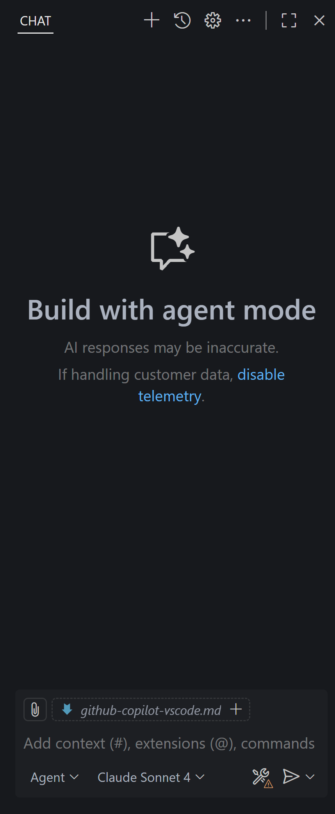

# 🚀 GitHub Copilot Workshop - VS Code Edition
*Master AI-powered development directly in your IDE with GitHub's most intelligent coding assistant*

---
## 🎯 Workshop Overview

Welcome to an immersive VS Code experience with GitHub Copilot! This hands-on workshop will revolutionize your development workflow by leveraging AI to write better code faster, generate comprehensive documentation, and create robust test suites with unprecedented efficiency.

### What You'll Master
- 📝 **AI-Powered Documentation**: Transform undocumented code into developer-friendly documentation instantly
- 🧪 **Intelligent Test Generation**: Achieve company-standard code coverage effortlessly
- ⚡ **Rapid Code Enhancement**: Let Copilot handle routine improvements while you focus on innovation
- 🔄 **Seamless IDE Integration**: Experience the future of coding directly in your favorite editor

---

## 🛠️ Workshop Instructions

### 🌟 Getting Started with GitHub Copilot in VS Code

GitHub Copilot transforms your VS Code environment into an AI-powered development powerhouse, providing intelligent assistance exactly when and where you need it.



---

## 📋 Task 1: The Documentation Wizard - Transform Code into Crystal-Clear Docs

> **🎭 Scenario:** *You've inherited a Flask web application that showcases Copilot features, but it lacks proper documentation. Your mission: transform this undocumented codebase into a developer-friendly masterpiece that will make your team's collaboration seamless and efficient.*

### 🎯 Objective
Transform an undocumented Flask application into a comprehensive, well-documented codebase that serves as a model for team collaboration and best practices.

---

### 📝 Step-by-Step Instructions

#### 🚀 Phase 1: Activate Your AI Documentation Assistant

1. **💬 Open GitHub Copilot Chat in VS Code**
   - Press `Ctrl+Shift+I` (Windows/Linux) or `Cmd+Shift+I` (Mac)
   - The AI-powered chat panel will open, ready to assist you

2. **🎯 Deploy the Documentation Enhancement Prompt**
   
   Copy and paste this prompt into Copilot Chat:
   ```
   Your task is to generate clear, developer-friendly documentation that explains what each function, class, and API endpoint does.
   Update the code and create the relevant docs accordingly.

   When generating code, documentation, or text:
   - Summarize intent briefly before or after producing code
   - Prefer clarity over cleverness: short, well-named functions and clear logic
   - Reuse existing utilities and avoid duplication
   - Add comprehensive docstrings with examples and parameter descriptions
   - Include type hints for better IDE support
   - Add inline comments for complex logic
   - Generate README sections that explain the application architecture
   - Create API endpoint documentation with request/response examples
   - Encourage testing and validation of new code
   - Respect explicit developer instructions
   - Never invent facts, sources, or data
   ```

#### ✨ Phase 2: Watch the Magic Happen

3. **🔍 Analyze Generated Improvements**
   
   Copilot will provide:
   - ✅ **Enhanced Docstrings**: Comprehensive function documentation
   - ✅ **Type Annotations**: Better IDE support and code clarity
   - ✅ **README Content**: Architecture explanations and setup instructions
   - ✅ **API Documentation**: Clear endpoint descriptions with examples
   - ✅ **Code Comments**: Strategic inline explanations

4. **📊 Review and Implement Suggestions**
   - 🔍 Examine each suggestion carefully
   - ✅ Apply improvements that align with your project standards
   - ❓ Ask follow-up questions for clarification

#### 🎯 Phase 3: Generate Documentation for Specific Code

1. **📂 Open the Flask Application**
   - Navigate to and open `app.py` in VS Code

2. **🔍 Analyze Code with Copilot**
   - Select any code block and choose the `/explain` option for detailed breakdown
   - Use GitHub Copilot Chat to gain insights into complex functions

3. **📝 Generate Function Documentation**
   - Select the entire function you want to document
   - Press `Ctrl+I` on *Windows* or `Cmd+I` on *MacOS*
   - Type `/doc` and press Enter
   - GitHub Copilot will generate comprehensive documentation

---

### 💡 Pro Tips for Maximum Impact
- 🎯 **Be Specific**: Ask for documentation for specific functions or modules
- 📝 **Request Examples**: Always ask for usage examples in docstrings  
- 👥 **Think User-First**: Consider what a new developer needs to know
- 🔄 **Iterative Improvement**: Build on Copilot's suggestions with follow-up prompts

---

## 🧪 Task 2: The Test Coverage Champion - Achieve 80% Coverage Effortlessly

> **🎭 Scenario:** *Your organization mandates 80% code coverage for all projects. Instead of spending hours writing repetitive test cases, you'll use GitHub Copilot to generate comprehensive, meaningful tests that not only meet coverage requirements but actually improve code quality and catch potential bugs.*

### 🎯 Objective
Create a comprehensive test suite that achieves company-standard 80% code coverage while ensuring code reliability and maintainability.

---

### 📝 Step-by-Step Instructions

#### 🎪 Phase 1: Strategic Test Planning

1. **🧠 Initiate Test Strategy Discussion**
   
   Copy and paste this comprehensive prompt into Copilot Chat:
   ```
   I need to create comprehensive tests for our Flask application to achieve 80% code coverage that meets company policy.

   Please analyze the current app.py file and create:
   - Unit tests for all functions and routes
   - Integration tests for API endpoints  
   - Edge case testing for error conditions
   - Mock testing for external dependencies
   - Performance tests for critical paths
   - Test fixtures for consistent test data

   Ensure tests are:
   - Well-structured and maintainable
   - Include both positive and negative test cases
   - Use pytest best practices
   - Include proper setup and teardown
   - Cover error handling and edge cases
   - Include docstrings explaining test purpose

   Create a complete test file structure that a QA engineer would be proud of.
   ```

## 🐛 Task 3: The Bug Detective Champion - Master Code Debugging

> **🎭 Scenario:** *You started to notice weird bugs that suddenly started appearing in your code. You are tasked with finding the bugs and fixing them using GitHub Copilot's powerful debugging capabilities.*

### 🎯 Objective
Identify, analyze, and fix bugs in your code using GitHub Copilot as your intelligent debugging assistant.

---

### 📝 Step-by-Step Instructions

#### 🎪 Phase 1: Release the Bugs Into Your Code

1. **📂 Navigate and Execute Bug Script**
   
   Navigate to the bugs directory and move the relevant script to the root of the project:
   
   **For Windows (PowerShell):**
   ```powershell
   mv ./bugs/introduce_bugs.ps1 ./; ./introduce_bugs.ps1
   ```
   
   **For Linux/Mac (Bash):**
   ```bash
   mv ./bugs/introduce_bugs.sh ./; sh introduce_bugs.sh
   ```

2. **⚠️ Observe the Chaos**
   - Open `app.py` and notice the red error indicators
   - Try running the application to see error messages
   - Don't worry - this is all intentional for learning! 🎓

---

#### 🔍 Phase 2: Debug and Fix with Copilot Power

1. **🧠 Deploy the Master Debugging Prompt**
   
   Copy and paste this comprehensive prompt into Copilot Chat:
   ```
   🤖 Bug Detective & Code Fixer:

   My Flask application suddenly has multiple bugs and errors after running a script. 
   Please analyze the current app.py file and help me:

   1. **Identify All Issues:**
      - Syntax errors (missing colons, commas, quotes)
      - Variable naming problems (misleading or unclear names)
      - Undefined variables or incorrect references
      - Indentation issues
      - Missing imports or dependencies
      - Logic errors or incomplete code blocks

   2. **Fix Each Problem Systematically:**
      - Correct all syntax errors with proper Python syntax
      - Rename variables to be more descriptive and meaningful
      - Add missing code elements (imports, variables, etc.)
      - Fix indentation to follow Python standards
      - Complete any incomplete data structures or functions

   3. **Validate All Fixes:**
      - Ensure the Flask app can run without errors
      - Test that all routes respond correctly
      - Verify all functions work as expected
   ```

2. **🔧 Advanced Debugging Techniques**
   - 🎯 **Selective Debugging**: Highlight problematic code and ask *"What's wrong with this code?"*
   - 🔨 **Step-by-Step Fixes**: Use *"Fix this syntax error"* for specific issues
   - ✅ **Code Validation**: After fixes, ask *"Is this code now correct and following best practices?"*
   - 🧪 **Test Your Fixes**: Run `python app.py` after each major fix

3. **🏆 Success Validation Checklist**
   - ✅ Application starts without errors
   - ✅ All routes are accessible  
   - ✅ Code follows Python best practices
   - ✅ Variables have descriptive names
   - ✅ Templates can be rendered properly

---

### 💡 Pro Debugging Tips
- 🚨 **Start with Syntax**: Fix red squiggly lines first
- 🔄 **Test Incrementally**: Run the app after each major fix
- 📝 **Ask for Explanations**: "Why was this causing an error?"
- 🎯 **Learn Prevention**: "How can I avoid this type of bug?"


## 🏆 Workshop Success Metrics

By the end of this workshop, you should have mastered:

- [ ] **Documentation**: Transform any undocumented code into clear, comprehensive docs
- [ ] **Test Coverage**: Achieve and maintain company-standard code coverage effortlessly
- [ ] **AI-Powered Development**: Seamlessly integrate Copilot into your daily workflow
- [ ] **Code Quality Standards**: Elevate codebases to production-ready status
- [ ] **Collaborative Development**: Create code that welcomes new team members
- [ ] **Best Practices Implementation**: Apply industry standards automatically

---

## 🌟 Advanced VS Code Copilot Techniques

### 🔮 Pro Developer Workflows

- **🎨 Refactoring Assistant**: Ask Copilot to suggest code improvements and optimizations
- **🔍 Code Review Partner**: Use Copilot to review code changes before commits
- **📚 Learning Accelerator**: Explore new frameworks and patterns with AI guidance
- **🚀 Feature Development**: Prototype new features rapidly with AI assistance

### 💡 Power User Tips

- **Context Awareness**: Include relevant files in your chat for better suggestions
- **Incremental Development**: Build features step-by-step with Copilot guidance
- **Error Resolution**: Let Copilot help debug and fix issues instantly
- **Code Explanation**: Ask Copilot to explain complex code patterns

---

## 📚 Additional Resources

- 📖 [GitHub Copilot in VS Code Documentation](https://docs.github.com/en/copilot/using-github-copilot/using-github-copilot-in-your-ide)
- 🎥 [VS Code Copilot Best Practices](https://code.visualstudio.com/docs/copilot/overview)
- 🛠️ [Flask Testing Guide](https://flask.palletsprojects.com/en/latest/testing/)
- 📊 [Python Coverage.py Documentation](https://coverage.readthedocs.io/)

---

## 💬 Share Your Success

Transform your development experience and share it with the community!

- 🐦 **Connect on LinkedIn**: [Michael Liav LinkedIn](https://www.linkedin.com/in/michael-liav-a5484b220/)
- 💡 **Share with Your Team**: Spread the AI-powered development revolution
- 🌟 **Star This Repository**: Help others discover these powerful techniques
- 📝 **Document Your Journey**: Create your own Copilot success stories

---

## 🎓 Next Steps: Becoming a Copilot Expert

## 📜 License

This workshop is part of the GitHub Copilot educational series, designed to empower developers with AI-assisted coding capabilities.

*Happy Coding with AI! 🚀*